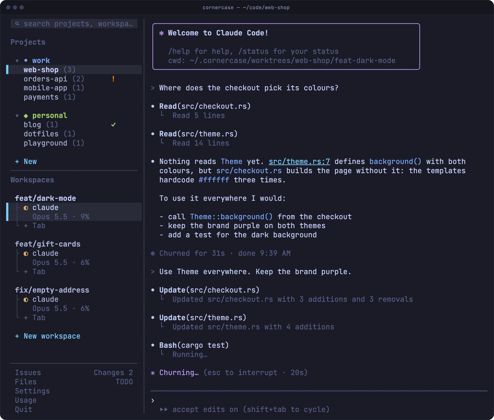

# cornercase

[](https://github.com/usecornercase/cornercase-terminal/actions/workflows/ci.yml?query=branch%3Amain)
[](https://github.com/usecornercase/cornercase-terminal/releases/latest)
[](#license)
[](https://usecornercase.dev/docs/)

A terminal multiplexer built for running coding agents in parallel. Every agent gets its own git worktree and tab, the sidebar shows which ones are working, waiting or done, the diff sits next to the agent, and a background server keeps everything running when you close the window. Everything is a click: your keyboard stays with the program in the pane.



**[usecornercase.dev](https://usecornercase.dev)** · [First steps](https://usecornercase.dev/docs/first-steps/) · [Try the live simulation](https://usecornercase.dev/#demo)

## Why

Starting ten agents is easy. Keeping up with them is the hard part. cornercase does four things about it:

1. **From an issue to an agent at work, in one click.** Open an issue from GitHub, Linear, Jira or Shortcut and press `start`: cornercase creates a worktree on a branch named after the issue, opens a tab in it and hands the issue to the agent as its first prompt. Claude Code, Codex, Gemini and [eleven more](https://usecornercase.dev/docs/reference/agents/). [Issues to agents](https://usecornercase.dev/docs/guides/issues-and-agents/)
2. **Every agent in its own corner, all of them in one view.** Each agent has its own branch, folder and tab, so two of them never touch the same file. Tabs show who is working `◐`, who needs you `!` and who finished while you were away `✓`, with the model and how full its context is. `!` and `✓` climb to the workspace and project rows, and your terminal notifies you, also over SSH. [Projects, workspaces and tabs](https://usecornercase.dev/docs/guides/projects-workspaces-tabs/)
3. **The review next to the work.** The changes panel shows the workspace's diff as the agent writes it: uncommitted, its commits, or everything since a base branch. Hover a hunk to open it in your editor, copy it or hand it back to the agent. The files panel browses, reads and searches the workspace, and a path an agent prints is a link. [Changes](https://usecornercase.dev/docs/guides/changes/) · [Files](https://usecornercase.dev/docs/guides/files/)
4. **Close the window. Nothing stops.** A background server owns the shells. `Quit` detaches, `cornercase` reattaches, from any terminal or from your phone over SSH, and several windows can show the same session. [Sessions](https://usecornercase.dev/docs/guides/sessions/)

And the `cornercase` command does all of it from a script, so one agent can run the others. [Scripts and agents](https://usecornercase.dev/docs/guides/scripts-and-agents/)

## Install

Linux and macOS, x86_64 and arm64:

```sh
curl -fsSL https://usecornercase.dev/install.sh | sh
```

Or with Homebrew:

```sh
brew install usecornercase/tap/cornercase
```

cornercase checks GitHub for a new release every hour. When there is one, a ` ↑ ` button next to ` Settings ` shows what is new and installs it; `cornercase update` does the same from a shell. [Installation](https://usecornercase.dev/docs/installation/)

<details>
<summary>From source</summary>

You need Linux or macOS (on macOS, the Xcode Command Line Tools: `xcode-select --install`), [rustup](https://rustup.rs), which installs the Rust version pinned in `rust-toolchain.toml` on the first build, [Zig 0.15.2](https://ziglang.org/download/) on your `PATH` (exactly this version: it builds Ghostty's terminal core, which refuses any other, so download it from ziglang.org rather than a package manager if in doubt), `git`, and network access for the first build, which fetches Ghostty's sources.

```sh
git clone https://github.com/usecornercase/cornercase-terminal.git
cd cornercase-terminal
cargo install --path . --locked
```

The first build takes a couple of minutes.

</details>

## First steps

1. Run `cornercase`. It starts the server and opens the window.
2. `+ New` → **open project** → pick a folder. The project gets a workspace and a shell.
3. `Issues` → pick one → `start`. Or `+ New workspace` for a worktree of your own, then type `claude` in its tab.
4. Watch the icons in the sidebar. `Changes` shows the diff, `Files` the code, `TODO` your list.
5. `Quit` closes the window and leaves everything running. `cornercase` brings it back.

Keys always go to the program in the active pane: there are no shortcuts to learn unless you choose a [prefix key](https://usecornercase.dev/docs/reference/keyboard-and-mouse/). Below 90 columns the sidebar folds into a menu bar, so it works on a phone over SSH. The whole walkthrough is in [First steps](https://usecornercase.dev/docs/first-steps/).

## From scripts and agents

```sh
pane=$(cornercase start claude --worktree fix-login --prompt 'Fix the login form, then commit')
cornercase wait --pane "$pane" --timeout 1800   # until the agent stops: idle, done or waiting
cornercase read --pane "$pane" --last-message   # what it said, from its own transcript
```

`cornercase --help` lists every command: open projects and worktrees, split panes, type into them, press keys, wait on one agent or several, follow events as they happen. Teach it to your agents with `npx skills add usecornercase/cornercase-terminal --skill cornercase -g`. [Scripts and agents](https://usecornercase.dev/docs/guides/scripts-and-agents/)

## Everything else

- **Layouts.** Projects and workspaces stacked in one column, side by side, or as one tree; groups with an icon and a colour; drag to reorder. [Arrange the columns](https://usecornercase.dev/docs/guides/projects-workspaces-tabs/#arrange-the-columns)
- **Splits.** Right-click a pane to split it right or down, drag the dividers to resize, right-drag a pane onto another to move it. [Panes and splits](https://usecornercase.dev/docs/guides/panes-and-splits/)
- **Search.** Any group, project, workspace or tab by name, as you type. [Search](https://usecornercase.dev/docs/guides/search/)
- **TODO list.** One list beside the pane for what comes next. [TODO list](https://usecornercase.dev/docs/guides/todo/)
- **Plan usage.** ` Usage ` shows how much of your Claude Code and Codex limits is left. [Plan usage](https://usecornercase.dev/docs/guides/projects-workspaces-tabs/#plan-usage)
- **Remote machines.** `cornercase remote <host>` keeps the window on your laptop and the shells and agents on another machine, over your own `ssh`, and reconnects by itself when the connection drops. [Remote machines](https://usecornercase.dev/docs/guides/remote/)
- **A real terminal inside.** Panes run on [libghostty-vt](https://github.com/ghostty-org/ghostty), Ghostty's terminal core, so nvim, fzf, htop and full-screen agents work as expected, in your terminal's own colours.
- **Settings.** ` Settings ` in the sidebar; every change is saved at once to `~/.config/cornercase/config.json`. [Settings and config.json](https://usecornercase.dev/docs/reference/configuration/) · [Files and environment](https://usecornercase.dev/docs/reference/files-and-environment/)

## Contributing

See [CONTRIBUTING.md](CONTRIBUTING.md). The rules for contributors and coding agents are in [AGENTS.md](AGENTS.md), and the design decisions with their reasons in [DESIGN.md](DESIGN.md). The website and its documentation live in [`site/`](site).

## License

Licensed under either of

- Apache License, Version 2.0 ([LICENSE-APACHE](LICENSE-APACHE))
- MIT license ([LICENSE-MIT](LICENSE-MIT))

at your option.

Unless you explicitly state otherwise, any contribution intentionally submitted for inclusion in the work by you, as defined in the Apache-2.0 license, shall be dual licensed as above, without any additional terms or conditions.
