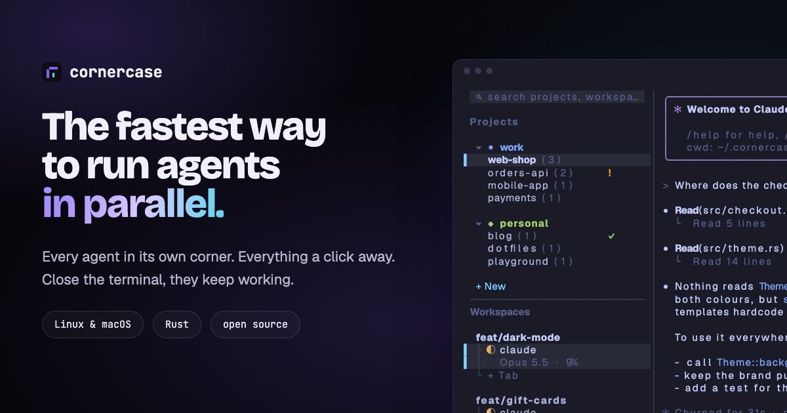

# cornercase

[](https://github.com/usecornercase/cornercase-terminal/actions/workflows/ci.yml?query=branch%3Amain)
[](https://github.com/usecornercase/cornercase-terminal/releases/latest)
[](#license)
[](https://usecornercase.dev/docs/)

A terminal multiplexer for working on several projects at once, each with its own git worktrees and coding agents. Every action is a mouse button, so you never need to learn a prefix key.



**Website and documentation:** https://usecornercase.dev

## What it does

- **[Projects, workspaces, tabs](https://usecornercase.dev/docs/guides/projects-workspaces-tabs/).** Projects (folders), optionally in groups with an icon and a colour; per project its workspaces (lines of work) and their tabs. Click to switch, `+` to create, drag to reorder, right-click to rename.
- **[Sidebar layouts](https://usecornercase.dev/docs/guides/projects-workspaces-tabs/#arrange-the-columns).** Both lists stacked in one column, side by side, or one tree of every project, workspace and tab.
- **[Git worktrees](https://usecornercase.dev/docs/guides/worktrees/).** A workspace can get its own worktree and branch, with `.worktreeinclude` files (such as `.env`) copied in; worktrees made outside cornercase show up too.
- **[Splits](https://usecornercase.dev/docs/guides/panes-and-splits/).** Right-click a pane to split it right or down; drag the dividers to resize.
- **[Issues to agents](https://usecornercase.dev/docs/guides/issues-and-agents/).** Read GitHub, Shortcut, Linear and Jira issues as Markdown and start one: a worktree on a matching branch, your agent (Claude Code, Codex, Gemini, …) in a new tab, the issue as its prompt.
- **[Agent status](https://usecornercase.dev/docs/guides/projects-workspaces-tabs/#what-your-agents-are-doing).** Claude Code and Codex tabs show whether the agent is working (`◐`), needs you (`!`) or finished while you were elsewhere (`✓`), and their model and context use (`Opus 5.5 · 23%`); `!` and `✓` also mark the workspace and project.
- **[Notifications](https://usecornercase.dev/docs/guides/projects-workspaces-tabs/#notifications).** A toast and a desktop notification through your terminal when an agent needs you or finishes, also over SSH.
- **[Plan usage](https://usecornercase.dev/docs/guides/projects-workspaces-tabs/#plan-usage).** ` usage ` shows how much of your Claude Code and Codex session and weekly limits you have used.
- **[Changes](https://usecornercase.dev/docs/guides/changes/).** The workspace's git diff beside the pane: uncommitted, its commits or both, against a base branch you pick; hand a hunk to the agent.
- **[Files](https://usecornercase.dev/docs/guides/files/).** Browse, read and search the workspace's files, highlighted and with changes marked; click a path an agent prints to open it, select lines to hand `path:12-30` to the agent.
- **[TODO list](https://usecornercase.dev/docs/guides/todo/).** One list beside the pane for what comes next.
- **[Search](https://usecornercase.dev/docs/guides/search/).** Jump to any group, project, workspace or tab by name.
- **[Scripts and agents](https://usecornercase.dev/docs/guides/scripts-and-agents/).** The `cornercase` command opens tabs and worktrees, starts agents, types into panes, waits for them and reads what they wrote, so one agent can coordinate others.
- **[Sessions survive the UI](https://usecornercase.dev/docs/guides/sessions/).** A background server owns the shells: closing the window detaches, `cornercase` reattaches, and several terminals can mirror each other.
- **[Remote machines](https://usecornercase.dev/docs/guides/remote/).** `cornercase remote <host>` keeps the window on your laptop and the shells and agents on another machine, over your own `ssh`, and reconnects by itself when the connection drops.
- **A real terminal inside.** Panes run on [libghostty-vt](https://github.com/ghostty-org/ghostty), Ghostty's terminal core, so nvim, fzf, htop and full-screen agents work as expected.
- **[Small terminals](https://usecornercase.dev/docs/guides/small-terminals/).** Below 90 columns the sidebar folds into a menu bar.

## Install

Linux and macOS, on x86_64 and arm64:

```sh
curl -fsSL https://usecornercase.dev/install.sh | sh
```

or with Homebrew:

```sh
brew install usecornercase/tap/cornercase
```

cornercase checks GitHub for a new release every hour. When there is one, a ` ↑ ` button next to ` settings ` shows what is new and installs it; `cornercase update` does the same from a shell. See [Installation](https://usecornercase.dev/docs/installation/).

### From source

You need:

- Linux or macOS (on macOS, the Xcode Command Line Tools: `xcode-select --install`)
- [rustup](https://rustup.rs) (it installs the Rust version pinned in `rust-toolchain.toml` on the first build)
- [Zig 0.15.2](https://ziglang.org/download/) on your `PATH`, exactly this version: it builds Ghostty's terminal core, which refuses any other. Package managers such as Homebrew may ship a newer one, so download it from ziglang.org if in doubt.
- `git`, and network access for the first build (it fetches Ghostty's sources)

```sh
git clone https://github.com/usecornercase/cornercase-terminal.git
cd cornercase-terminal
cargo install --path . --locked
```

The first build takes a couple of minutes.

## Usage

```sh
cornercase              # open the UI (starts the server if needed)
cornercase update       # install the latest release and restart the server
cornercase kill-server  # stop the server and every shell in it
cornercase --help       # every command, including the ones for scripts and agents
```

From a script or an agent in one of cornercase's panes:

```sh
pane=$(cornercase start claude --worktree fix-login --prompt 'Fix the login form, then commit')
cornercase wait --pane "$pane" --timeout 1800   # until the agent stops working: idle, done or waiting
cornercase read --pane "$pane" --lines 40
```

Install the skill that teaches your agents these commands with `npx skills add usecornercase/cornercase-terminal --skill cornercase -g`.

Keys always go to the program in the active pane. Start with [First steps](https://usecornercase.dev/docs/first-steps/).

## Configuration

Open ` settings ` in the sidebar; changes are saved at once to `~/.config/cornercase/config.json`. Every setting is in [Settings and config.json](https://usecornercase.dev/docs/reference/configuration/), and the files and environment variables cornercase uses in [Files and environment](https://usecornercase.dev/docs/reference/files-and-environment/).

## Contributing

See [CONTRIBUTING.md](CONTRIBUTING.md). The rules for contributors and coding agents are in [AGENTS.md](AGENTS.md), and design notes with the reasons behind them in [DESIGN.md](DESIGN.md). The website and its documentation live in [`site/`](site).

## License

Licensed under either of

- Apache License, Version 2.0 ([LICENSE-APACHE](LICENSE-APACHE))
- MIT license ([LICENSE-MIT](LICENSE-MIT))

at your option.

Unless you explicitly state otherwise, any contribution intentionally submitted for inclusion in the work by you, as defined in the Apache-2.0 license, shall be dual licensed as above, without any additional terms or conditions.
